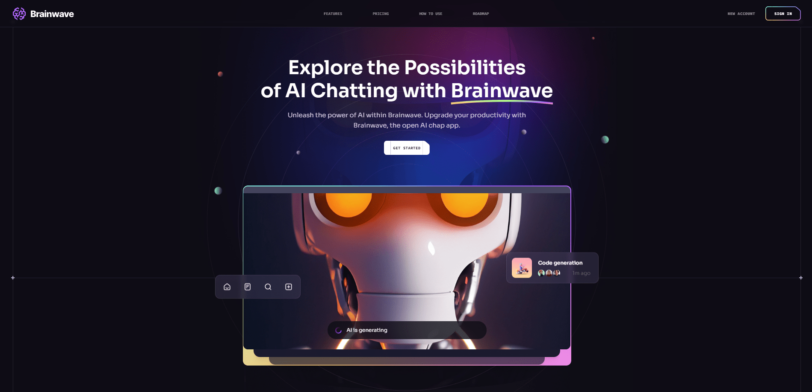

<div align="center">
  <a href="https://brainwave-ai-cm.netlify.app/" target="_blanck"></a>
  <h3 align="center">Brainwave</h3>
    <div align="center">
    
    
    
  </div>
</div>

## <br /> 📋 <a name="table">Summary</a>

- ✨ [Introduction](#introduction)
- 🛠 [Technology Used](#tech-stack)
- 🚀 [Launch App](#launch-app)
- 🎨 [Styling](#style)

## <br /> <a name="introduction">✨ Introduction</a>

**[ENG]** Brainwave is a modern AI-powered chat application, offering users an intuitive and interactive experience with OpenAI's advanced language model. This landing page and web application are designed to showcase the potential of AI-driven conversations through a seamless, visually appealing interface.

Built with React and TailwindCSS, Brainwave ensures a smooth user experience, enhanced by dynamic animations and responsive design. Leveraging react-just-parallax for immersive effects, scroll-lock for controlled scrolling, and react-icons for a polished UI, the platform delivers a sleek and engaging interaction. Navigation is handled efficiently with react-router-dom, ensuring a fluid and structured user journey.

**[FR]** Brainwave est une application de chat alimentée par l'IA, offrant une expérience interactive et intuitive grâce au modèle avancé d'OpenAI. Cette landing page et application web sont conçues pour mettre en avant le potentiel des conversations assistées par l'IA à travers une interface fluide et esthétiquement soignée.

Développé avec React et TailwindCSS, Brainwave garantit une expérience utilisateur optimale, enrichie par des animations dynamiques et un design réactif. L'application intègre react-just-parallax pour des effets immersifs, scroll-lock pour un contrôle précis du défilement, et react-icons pour une interface élégante. La navigation est gérée efficacement avec react-router-dom, assurant un parcours utilisateur fluide et structuré.

## <br /> <a name="tech-stack">🛠 Technology Used</a>

- [scroll-lock](https://www.npmjs.com/package/scroll-lock) :
Cross-browser JavaScript library to disable scrolling page

- [react-just-parallax](https://www.npmjs.com/package/react-just-parallax) :
React library for scroll and mousemove parallax effect ✨
Open source, production-ready

- [react-icon](https://www.npmjs.com/package/react-icons)
Include popular icons in your React projects easily with react-icons, which utilizes ES6 imports that allows you to include only the icons that your project is using.

- [react-router-dom](https://www.npmjs.com/package/react-router-dom)
- The react-router-dom package contains bindings for using React Router in web applications. Please see the Getting Started guide for more information on how to get started with React Router.
  
- [TailwindCSS](https://tailwindcss.com/docs/installation)
- TailwindCSS is a valuable tool for developers who want to build modern, responsive, and visually appealing websites without sacrificing development speed.

## <br /> <a name="launch-app">🚀 Launch App</a>

<br/>**Cloning the Repository**

```bash
git clone {git remote URL}
```

<br/>**installation**

> After cloning the repository, run the command `npm install` to install the project's dependencies.

> Once the dependencies are installed, start the project with the command `npm run dev`.

## <br /> <a name="launch-app">🎨 Styling</a>

Global styling are defined using TailwindCSS in the tailwind.config.js file.

```
theme: {
    extend: {
      colors: {
        color: {
          1: "#AC6AFF",
          2: "#FFC876",
          3: "#FF776F",
          4: "#7ADB78",
          5: "#858DFF",
          6: "#FF98E2",
        },
        stroke: {
          1: "#26242C",
        },
        n: {
          1: "#FFFFFF",
          2: "#CAC6DD",
          3: "#ADA8C3",
          4: "#757185",
          5: "#3F3A52",
          6: "#252134",
          7: "#15131D",
          8: "#0E0C15",
          9: "#474060",
          10: "#43435C",
          11: "#1B1B2E",
          12: "#2E2A41",
          13: "#6C7275",
        },
      },
      fontFamily: {
        sans: ["var(--font-sora)", ...fontFamily.sans],
        code: "var(--font-code)",
        grotesk: "var(--font-grotesk)",
      },
      letterSpacing: {
        tagline: ".15em",
      },
      spacing: {
        0.25: "0.0625rem",
        7.5: "1.875rem",
        15: "3.75rem",
      },
      opacity: {
        15: ".15",
      },
      transitionDuration: {
        DEFAULT: "200ms",
      },
      transitionTimingFunction: {
        DEFAULT: "linear",
      },
      zIndex: {
        1: "1",
        2: "2",
        3: "3",
        4: "4",
        5: "5",
      },
      borderWidth: {
        DEFAULT: "0.0625rem",
      },
      backgroundImage: {
        "radial-gradient": "radial-gradient(var(--tw-gradient-stops))",
        "conic-gradient":
          "conic-gradient(from 225deg, #FFC876, #79FFF7, #9F53FF, #FF98E2, #FFC876)",
        "benefit-card-1": "url(assets/benefits/card-1.svg)",
        "benefit-card-2": "url(assets/benefits/card-2.svg)",
        "benefit-card-3": "url(assets/benefits/card-3.svg)",
        "benefit-card-4": "url(assets/benefits/card-4.svg)",
        "benefit-card-5": "url(assets/benefits/card-5.svg)",
        "benefit-card-6": "url(assets/benefits/card-6.svg)",
      },
    },
  },
```
